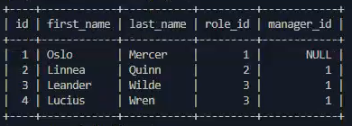

# employee-tracker

## Description

The purpose of this application is to allow business owners to view and manage their departments, roles, and employees within the company to stay organized. 

## Installation

To use this application, clone the project files from [the employee-tracker repository](https://github.com/Camparooni/employee-tracker) and open the index.js file. Make sure you have node.js downloaded to your computer and have ran `npm install` to download the necessary npm package dependencies. 

### Link

View a walkthough [here](https://drive.google.com/file/d/1l9PQpTVgfHBhU06B5X8Igm3RK1outq-4/view)

## Badges

